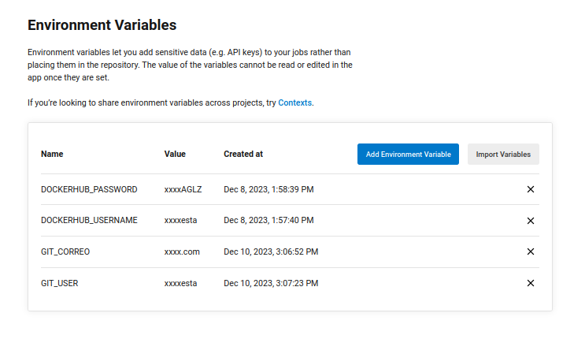
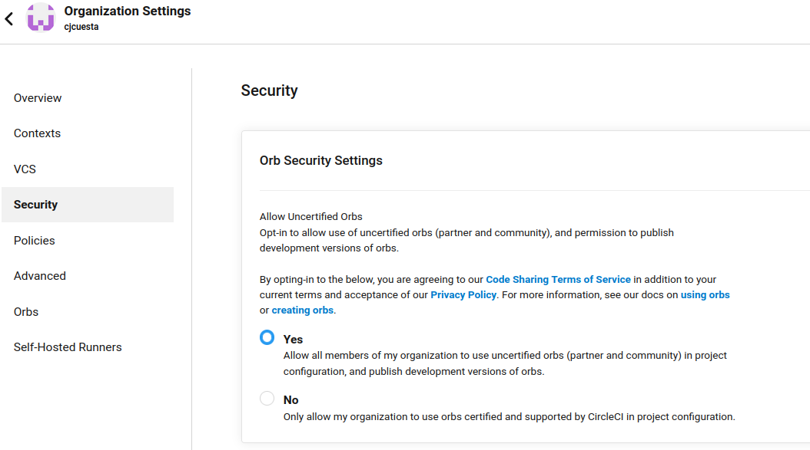
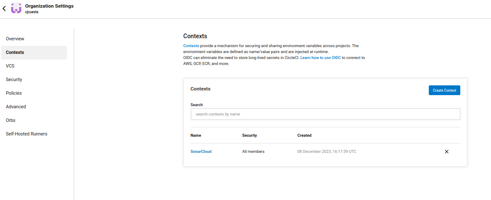
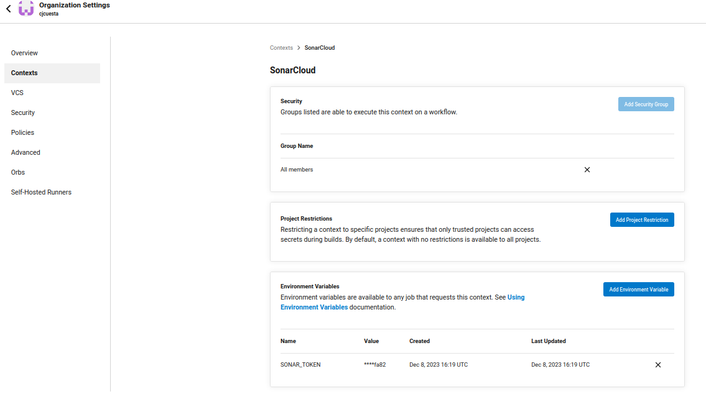
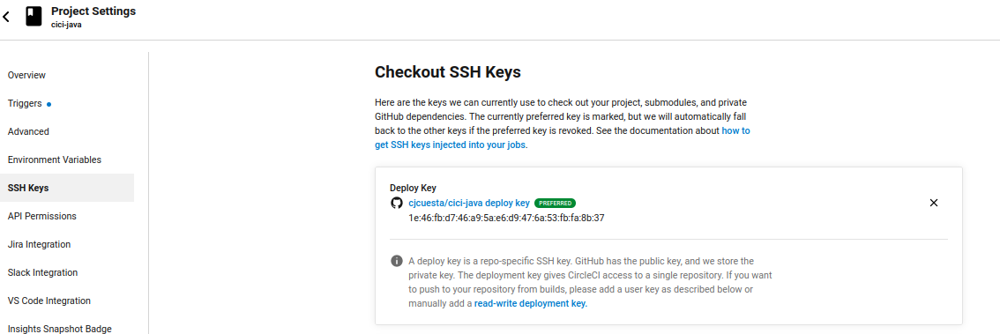
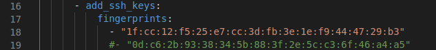

# cici-java

## Configuración
* Se debe instalar argocd de acuerdo a lo visto en clase 
* Se debe instalar circleci de acuerdo a lo visto en clase
* Se deben hacer las siguientes configuraciones















* Enlace a videos: [videos](https://drive.google.com/drive/folders/1w1wTkQCnmz5Tn2vzvpUnhsdk2fJH0w_t?usp=sharing)

Se debe descargar el repositorio
```
git clone git@github.com:cjcuesta/cici-java.git
```
Se realiza un cambio en el respositorio

```
circleci config validate .circleci/config.yml && \
git pull && \
git add . && \
git commit -m "Modificacion deployment 28" && \
git push && \
git tag v0.0.28 && \
git push --tag

```

